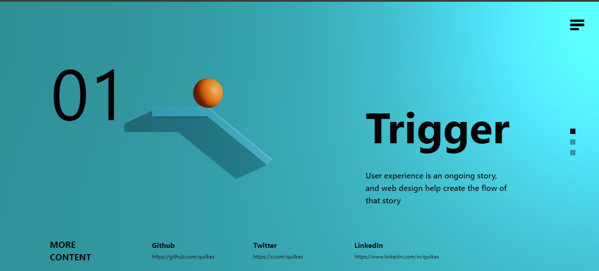

<h1>Physics-Based Website</h1>
[Link Text](https://physics-interaction.netlify.app/)

This is a <strong>physics-based website</strong> built with <strong>React</strong>, <strong>React Three Fiber</strong>, and the <strong>Rapier</strong> physics engine. It leverages the power of <strong>three.js</strong> for 3D graphics and other libraries to enhance the user experience and development process.

<h2 style="color: #17a8ff;">Features</h2>

  
<strong>3D Graphics</strong>: Powered by three.js, providing high-quality 3D rendering.

  
<strong>Physics Engine</strong>: Utilizes Rapier for realistic physics simulations.

  
<strong>Interactive Animations</strong>: GSAP for smooth and interactive animations.

  
<strong>State Management</strong>: Managed using Zustand for a simplified and efficient state management solution.

